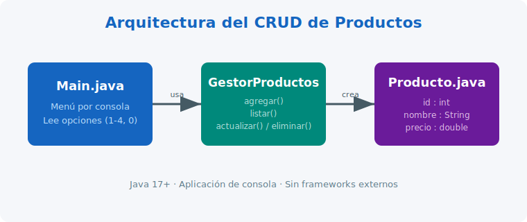

# Sistema CRUD de Productos en Java

Bienvenido a la documentación del **sistema CRUD de productos**, una aplicación de
consola desarrollada en **Java puro**, sin frameworks externos. Permite realizar las
cuatro operaciones fundamentales sobre un conjunto de productos: **Crear, Leer,
Actualizar y Eliminar** (Create, Read, Update, Delete).

## ¿Qué hace este proyecto?

- Crear nuevos productos (nombre y precio).
- Listar todos los productos registrados.
- Actualizar un producto por su `ID`.
- Eliminar un producto por su `ID`.

Cada producto tiene un identificador único que se asigna automáticamente.

!!! note "Sobre este proyecto"
    Fue desarrollado como práctica de **control de versiones con Git**, aplicando el
    flujo de trabajo GitFlow. El código fuente original se aloja en Codeberg y esta
    documentación se publica con MkDocs en GitHub Pages.

## Mapa de la documentación

| Página | Contenido |
| --- | --- |
| [Inicio](index.md) | Visión general del proyecto. |
| [Instalación y uso](instalacion.md) | Cómo compilar y ejecutar la aplicación. |
| [Operaciones CRUD](operaciones.md) | Detalle de cada operación con ejemplos. |
| [Referencia de clases](referencia.md) | Documentación de `Producto`, `GestorProductos` y `Main`. |

!!! tip "¿Por dónde empezar?"
    Si es tu primera vez, ve a [Instalación y uso](instalacion.md) para poner en
    marcha la aplicación en tu equipo.

## Tecnologías

- **Java 17+**
- **Git** y **Codeberg / GitHub** para control de versiones
- **MkDocs** + **Material for MkDocs** para esta documentación
